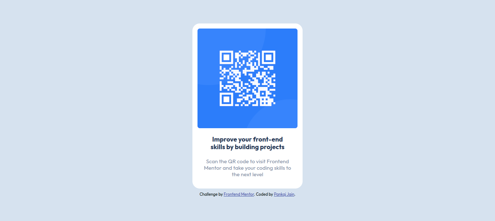

# Frontend Mentor - QR code component solution

This is a solution to the [QR code component challenge on Frontend Mentor](https://www.frontendmentor.io/challenges/qr-code-component-iux_sIO_H). Frontend Mentor challenges help you improve your coding skills by building realistic projects. 

## Table of contents

- [Overview](#overview)
  - [Screenshot](#screenshot)
  - [Links](#links)
- [My process](#my-process)
  - [Built with](#built-with)
  - [What I learned](#what-i-learned)
  - [Continued development](#continued-development)
  - [Useful resources](#useful-resources)
- [Author](#author)

## Overview

### Screenshot

**Desktop**



**Mobile**


### Links

- [Solution URL](https://www.frontendmentor.io/solutions/qr-code-component-using-flexbox-dwa-Fetli1)
- [Live Site URL](https://s1pjain.github.io/frontend-mentor-qr-code-component/)

## My process

### Built with

- Semantic HTML5 markup
- CSS custom properties
- Flexbox
- Mobile-first workflow

### What I learned

I have learned about using Semantic HTML5 markup and how to use the Flexbox. Also, used the CSS variables. I have also learned about how to import the fonts in the CSS. 

```html
<main class="card">
  <figure>
    <picture>
      
    </picture>
  </figure>
  <section>
    <h1 class="card__heading">Improve your front-end skills by building projects</h1>
    <p class="card__description">Scan the QR code to visit Frontend Mentor and take your coding skills to the next
      level</p>
  </section>
</main>
```
```css
@import url('https://fonts.googleapis.com/css2?family=Outfit:wght@400;700&display=swap');

:root {
  --white: hsl(0, 0%, 100%);
  --light-gray: hsl(212, 45%, 89%);
  --grayish-blue: hsl(220, 15%, 55%);
  --dark-blue: hsl(218, 44%, 22%);
}

body {
    font-family: 'Outfit', sans-serif;
    background: var(--light-gray);
    display: flex;
    flex-direction: column;
    justify-content: center;
    align-items: center;
}
```

### Continued development

I want to continue focusing on to learn the correct way of using semantic HTML and improve the CSS

### Useful resources

- [HTML Semantic Elements](https://www.w3schools.com/html/html5_semantic_elements.asp) - This helped me to know about the semantic HTML elements.

## Author

- Frontend Mentor - [@s1pjain](https://www.frontendmentor.io/profile/s1pjain)
- Twitter - [@s1pjain](https://www.twitter.com/s1pjain)
